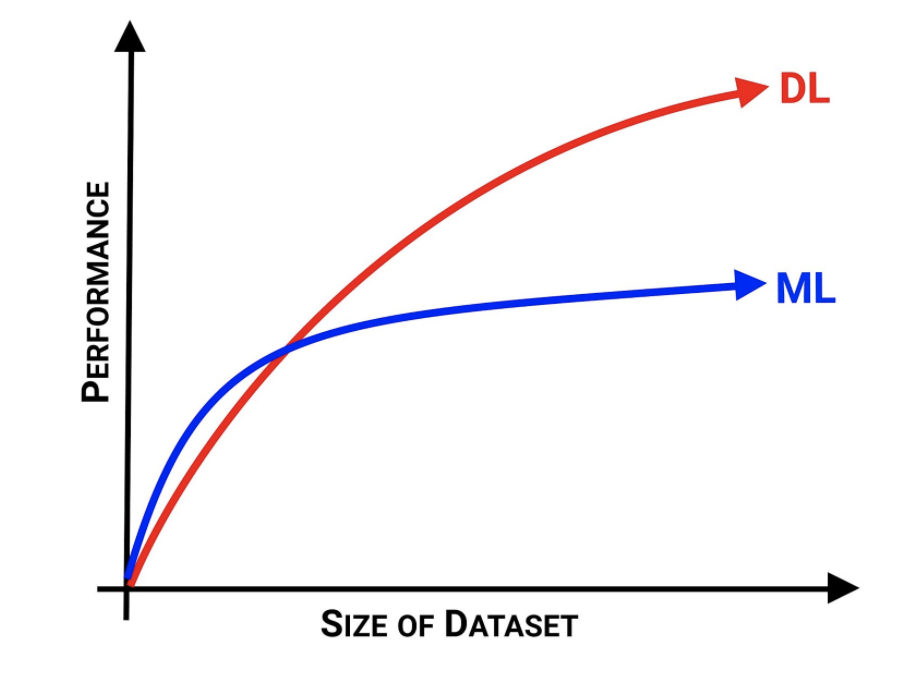
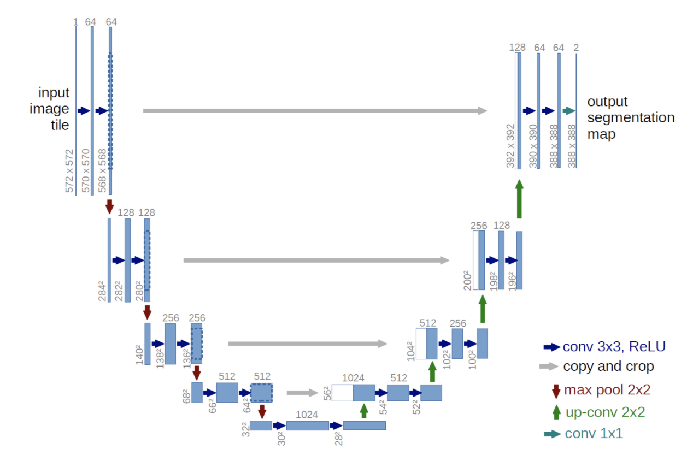

# Dataset

## Brain Mapping:
- Datasets are obtained through google image scraping and from [here](https://www.kaggle.com/navoneel/brain-mri-images-for-brain-tumor-detection)
- For mask images, JSON files are created by [VGG Image Annotator](https://www.robots.ox.ac.uk/~vgg/software/via/) and then converted to png file.

## Tumor Detection & Classification:
- Datasets are obtained from [here](https://www.kaggle.com/sartajbhuvaji/brain-tumor-classification-mri)

## Data Augmentation:
- Purpose: the massive increase in the scale of datasets that will be used for training/validation/test process for CNN model and U-Net architecture.
- Transformed versions of the original image dataset are created by applying image flip/rotation, changing image contrast, etc.

# Brain Mapping

## Input Validation (Image Classification):
- User input is validified through image classification using the CNN model. Only a valid type of image, sagittal view of brain MRI, can be used for brain mapping.
- 
## Brain Mapping (Image Segmentation):
- U-Net architecture is used for brain mapping. The U-Net architecture was inspired by [U-Net:](https://lmb.informatik.uni-freiburg.de/people/ronneber/u-net/) [Convolutional Networks for Biomedical Image Segmentation.](https://lmb.informatik.uni-freiburg.de/people/ronneber/u-net/) Between each layer, the size of the layer is reduced to avoid overflow.

# Tumor Detection & Classification

## Input Validation (Image Classification):
- User input is validified through image classification using the CNN model. Only a valid type of image, brain MRI (it can be any view), can be used for brain mapping.

## Tumor Detection & Classification:
- Through CNN model image classification, the given image can be classified as one of the following: no tumor, glioma, meningioma, and pituitary.

# Web Application
- Application is created using Flask and it is deployed on AWS (tba maybe Heroku??).

